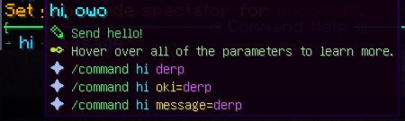
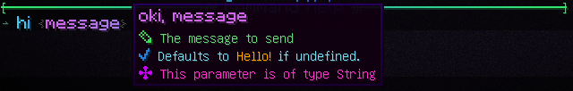

# Decree - How to
Decree is an advanced and easy-to-use command system.

## Setting up Decree with your Plugin
Before starting, make sure that in your `plugin.yml` config file you add the commands for your plugin:
```yaml
commands:
  mainCommandNameHere:
    aliases: [ cmmd, cmd, cd ]
```
Note that these must be the same as used in the main @Decree in your main command class (`MainCommandClass`)

Then, in the main plugin class,
```java
class YourPlugin extends JavaPlugin {
    @Override
    public void onEnable() {
        Bukkit.getConsoleSender().sendMessage("Hello world!");
    }

    @Override
    public void onDisable() {
        Bukkit.getConsoleSender().sendMessage("Goodbeye world!");
    }
}
```
implement DecreeSystem

```java
class YourPlugin extends JavaPlugin implements DecreeSystem {}
```

Decree will then ask to implement `#getRootClass` and `#instance`. You also need to point `#onCommand` and `#onTabComplete` to Decree.

Below here you find a recommended implementation of these functions:
```java
public class YourPlugin extends JavaPlugin implements DecreeSystem, DecreeExecutor {

    @Override
    public Plugin instance() {
        return this;
    }

    @Override
    public DecreeExecutor getRootClass() {
        return new MainCommandClass();
    }

    @Override
    public boolean onCommand(@NotNull CommandSender sender, @NotNull Command command, @NotNull String label, @NotNull String[] args) {
        return decreeCommand(sender, command, label, args);
    }

    @Nullable
    @Override
    public List<String> onTabComplete(@NotNull CommandSender sender, @NotNull Command command, @NotNull String alias, @NotNull String[] args) {
        return decreeTabComplete(sender, command, alias, args);
    }

    @Override
    public void onEnable() {
        Bukkit.getConsoleSender().sendMessage("Hello world!");
    }

    @Override
    public void onDisable() {
        Bukkit.getConsoleSender().sendMessage("Goodbeye world!");
    }
}
```
We use `MainCommandClass` as the main command. This class looks like this:
```java
@Decree(name = "command", aliases = {"cmmd", "cmd", "cd"}, description = "Main commands")
public class MainCommandClass implements DecreeExecutor {

    @Decree(
            description = "Send hello!",
            origin = DecreeOrigin.PLAYER,
            aliases = "owo",
            sync = true,
            name = "hi"
    )
    public void hello(
            @Param(
                    defaultValue = "Hello!", 
                    aliases = "oki", 
                    description = "The message to send"
            )
                    String message
    ){
        sender().sendMessage(message);
    }
}
```
Note how this class implements DecreeExecutor.<br>
DecreeExecutor comes with a suite of functions (which may be appended by more, freely),
which are to be used in the command handlers.

The non-message functions in the suite are: 
`#player`, `#sender`, and `#world`.<br>
`#sender` will return the command sender as a DecreeSender, to which you can then send messages.
Note that you can add colors to these messages by means of the `C.java` class (e.g. `C.RED`).
The other two are self-explanatory (note that `#player` and `#world` return `null` when the command is console-ran)

There are 4 message functions as well (with preset colors), `#message`, `#error`, `#warn`, and `#success` with no, red, yellow, and green color resp.

Running `/command` will show this:



## Explanation of annotation parameters
Decree makes use of 2 annotations to create and match commands, `@Decree` and `@Param`.
We use the example above (`MainCommandClass`).
### `@Decree`


You may assume the annotation description is the same for class & method unless explicitly mentioned otherwise.

Decrees are used on classes (command categories) and methods (commands).
Decrees take at most 5 parameters, `name`, `description`, `aliases`, `origin`, and `sync`.
- `name`
  - Name is the name of the category / command as used in the console or in-game command prompt. 
  - **Note** This argument is required on classes (categories)
    - On methods it is derived from the method name (`hello` in the example), but can be overwritten.
- `description`
  - The text description for the command or category. Shown in green in the example.
- `aliases`
  - The aliases of this command. This is not shown in the category listing, but does still point to this command.
  - **Note** Decree does not require perfect matches for matching.
    - Example: If your command is `print`, `/p` will also work, given any parameters match.
- `origin`
  - The origin from which the command can come.
  - Three possible values:
    - DecreeOrigin.PLAYER
    - DecreeOrigin.CONSOLE
    - DecreeOrigin.BOTH `default`
  - **Example** If you make a `tp` command that teleports the person that runs it, to another player, you should add `origin = DecreeOrigin.PLAYER`, since consoles cannot be teleported.
- `sync`
  - A boolean toggle for whether this command needs to be run synchronously. Use this sparingly, considering the advantages of an asynchronous environment.
  - **Recommendation** Test the command to see if it works async (default), and only make it sync if it does not.

### `@Param`
Decree uses parameters to match input commands against. 
These parameters are parameters in a method, which should be annotated by `@Decree` (it is not recognised otherwise).

Param has a number of sub-parameters, `name`, `description`, `aliases`, `defaultValue`, and `contextual`.
- `name`
  - The name of this parameter. 
  - When entering a command, you would use `name=<value>`. 
  - Decree can match without specifying `name=` to some degree.
  - By default, the name is the same as the annotated variable's name
- `description`
  - The description of this parameter.
- `aliases`
  - The aliases for this parameter (can be used instead of `name=<value>`)
- `defaultValue`
  - The default value that is parsed into the variable if it is not entered by the user.
  - Specifying this automatically makes the variable non-required.
- `contextual`
  - Setting this to true allows Decree to derive the variable from context.
  - This automatically makes the variable non-required __as long as it can be found__.
  - Context handlers are found in the `decree.context` directory, and the only context is `World`, which can currently be derived from players.
  - You can add more context handlers in that directory, make sure to also add them to the list of context handlers in `DecreeContextHandler`.

### Additional information
- The help menu for the root command:
<br>
Also shows some examples of command usages.
If you do not like the suggestions, they may be modified in the respecive type's handler. `decree.handlers`
- The help menu for parameters:
<br>
Also shows the type of variable it is supposed to parse into.
- You may not specify a type parameter in a Decree method that is not handled by one of the handlers in `decree.handlers`. You can of course add new handlers.
- You may not specify `contextual = true` on a parameter that does not have a context handler (anything apart from World, in the default case).
- You may specify sub-categories by means of a variable in the root class (or a sub-class in there) as follows:
```java
@Decree(name = "command", aliases = {"cmmd", "cmd", "cd"}, description = "Main commands")
public class MainCommandClass implements DecreeExecutor {
    
    // This line here
    private SubCommandClass nameDoesNotMatterHere;

    @Decree(
            description = "Send hello!",
            origin = DecreeOrigin.PLAYER,
            aliases = "owo",
            sync = true,
            name = "hi"
    )
    public void hello(
            @Param(
                    defaultValue = "Hello!", 
                    aliases = "oki", 
                    description = "The message to send"
            )
                    String message
    ){
        sender().sendMessage(message);
    }
}
```
Note that you shouldn't make recursive calls (loops)
- The example setup used in this guide is included. See the `decrees` directory.